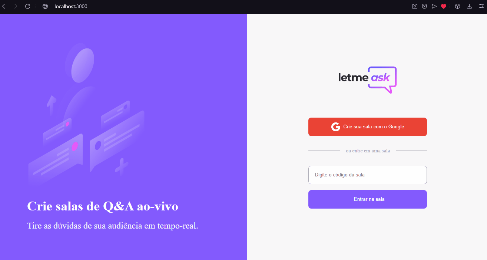

# Letmeask

## Demo 📸

 

## Application deploy with netlify: :dash:

> https://letmeask-wsl.netlify.app

## 📜 About the Project

Letmeask is a project developed together with rocketseat's nlw-togueter event. Letmeask is perfect for content/live creators to create rooms and answer live people's queries in real time. 

### 📋 User Stories:

 - [x] - Create rooms.
 - [x] - User can enter existing rooms.
 - [x] - User can ask questions in the room. 
 - [x] - Users can like the best questions 
 - [x] - Admin can highlight the question
 - [x] - Admin can mark questions answered
 - [x] - Admin can delete room and questions 

### 🛠 Technologies

<li><a href="https://reactjs.org">React.js</a></li>
<li><a href="https://sass-lang.com">SASS</a></li>
<li><a href="https://firebase.google.com">Firebase</a></li>
<li><a href="https://www.typescriptlang.org">Typescript</a></li>
<li><a href="https://reactrouter.com/web/guides/quick-start">React-router-dom</a></li>

## 💻 How to run the application

#### Pre-requisites:
You must have the tools installed:  <a href="">Git</a>, <a href="">Node.js</a> and a firebase account.

<pre>
# In the terminal, clone the project:
$ git clone https://github.com/Wesley-wsl/letMeAsk.git

# Enter the project folder:
$ cd let-me-ask

# Install dependencies:
$ yarn install
ou
$ npm install

# Run the application:
$ yarn start
ou
$ npm run start
</pre>

Okay, now you can access the application from the route:  <a href="https://localhost:3000/">https://localhost:3000/</a>
